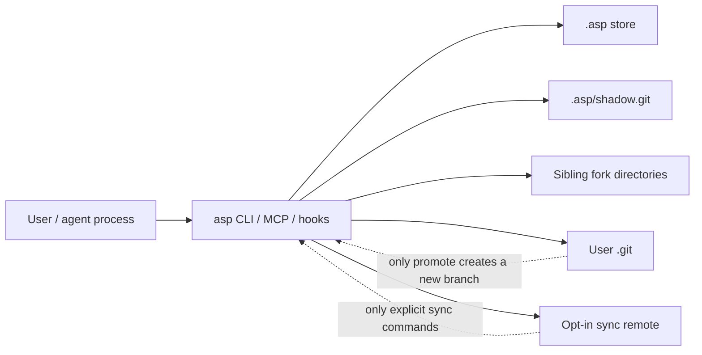

# Security Policy

## Reporting

Please report suspected vulnerabilities privately via
[GitHub Security Advisories](https://github.com/ArnavBorkar/agentspaces/security/advisories/new).
You'll get an acknowledgment within 72 hours.

Do not open public issues for suspected vulnerabilities until we have triaged
and coordinated disclosure.

## Threat Model

`asp` is a fully local tool: no network calls, no telemetry, no accounts. Its
job is to keep agent work durable and reviewable without weakening the user's
real repository.

### Assets

| Asset | Security requirement |
| --- | --- |
| User working tree | `asp` must not write outside the requested workspace or fork. |
| User `.git/` | Sacred by default; only `asp promote` may create a normal new branch. |
| `.asp/shadow.git` | Checkpoints must remain recoverable with stock git. |
| `.asp/journal.jsonl` | Torn writes must not fabricate valid history. |
| `.asp/blobs/` | Large-file CAS entries must match their BLAKE3 names. |
| Fork directories | Cleanup must delete only directories proven to be asp-owned. |
| Sync remotes | Upload/fetch must be explicit and verify object identities. |

### Trusted Inputs

- The local `asp` binary and its bundled Rust dependencies.
- The local `git` binary meeting the documented minimum version.
- Filesystem primitives such as atomic rename, file locks, and copy-on-write
  clone APIs when the platform reports support.

### Untrusted Inputs

- Workspace contents, filenames, symlinks, hardlinks, and file permissions.
- `.asp/` stores copied from another machine or included in an archive.
- Hook JSON read by `asp hook-event`.
- MCP requests and CLI arguments.
- Local sync remotes and mounted/shared directories.
- Commands passed to `asp race`.

## In Scope

Please report issues where `asp` can:

- read, write, restore, or delete paths outside the workspace or selected fork;
- write to the user's `.git/` except for the documented `promote` branch create;
- make a corrupt or malicious `.asp/` store execute code;
- follow symlinks or hardlinks in a way that escapes the intended directory;
- overwrite or delete user data during `doctor --fix`, `discard`, `restore`,
  `undo`, `sync fetch`, or fork cleanup without proof that asp owns it;
- accept remote sync objects, refs, or CAS blobs whose bytes do not match their
  content addresses;
- lose checkpoint recoverability after a crash, torn write, or lock contention;
- expose secrets through diagnostics that should be redacted by default;
- return misleading success for a failed safety-critical mutation.

## Out Of Scope

These may still be important operational risks, but they are not vulnerabilities
in `asp` by themselves:

- An agent or shell command intentionally reading files it already has OS
  permission to read.
- Code generated by an agent being malicious or vulnerable.
- Secrets committed to normal user git history outside `asp`.
- Files intentionally excluded from checkpoint scope by `.gitignore`,
  `.asp/config.toml`, or default derived-state excludes.
- Network exfiltration by tools the user or agent runs.
- Multi-user access control inside one shared checkout.
- Disk encryption, key management, or encrypted `.asp/` storage.
- Native Windows workspace support before the Windows support milestone ships.

## Security-Relevant Surfaces

### File Handling

`asp` reads and writes within the workspace root, `.asp/`, and sibling fork
directories. Store-supplied paths are validated against traversal before
restore or deletion. Checkpoints capture untracked-but-not-gitignored files into
the local `.asp/` store by design; gitignored secrets such as `.env` stay out of
checkpoints but are physically present in forks because forks are real directory
clones.

`.asp/` inherits your filesystem permissions. Add patterns to
`capture.extra_excludes` to keep more files out of checkpoints.

### Subprocess Execution

`asp` shells out to `git` with repository-location environment variables
scrubbed for safety-sensitive paths. `asp race` runs the command you pass in
each fork. `asp` never executes workspace content on its own.

### Hooks And MCP

`asp setup claude` installs hooks that run `asp hook-event`; the handler parses
untrusted JSON from stdin and always exits 0 so it does not break the agent
session. The MCP server treats client requests as untrusted and returns
structured errors for bad requests.

### Sync

Sync is explicit. No init, checkpoint, restore, fork, doctor, diagnostics, MCP,
or hook command starts sync. `asp sync push` and `asp sync fetch` verify git
object, ref, and CAS identities and must not silently overwrite conflicting
local or remote refs.

## More Detail

For a deeper review, see:

- [Trust model whitepaper](docs/trust-model.md)
- [On-disk format and recovery runbook](docs/design/format.md)
- [Sync protocol design](docs/design/sync-protocol.md)
- [Diagnostics guide](docs/diagnostics.md)
